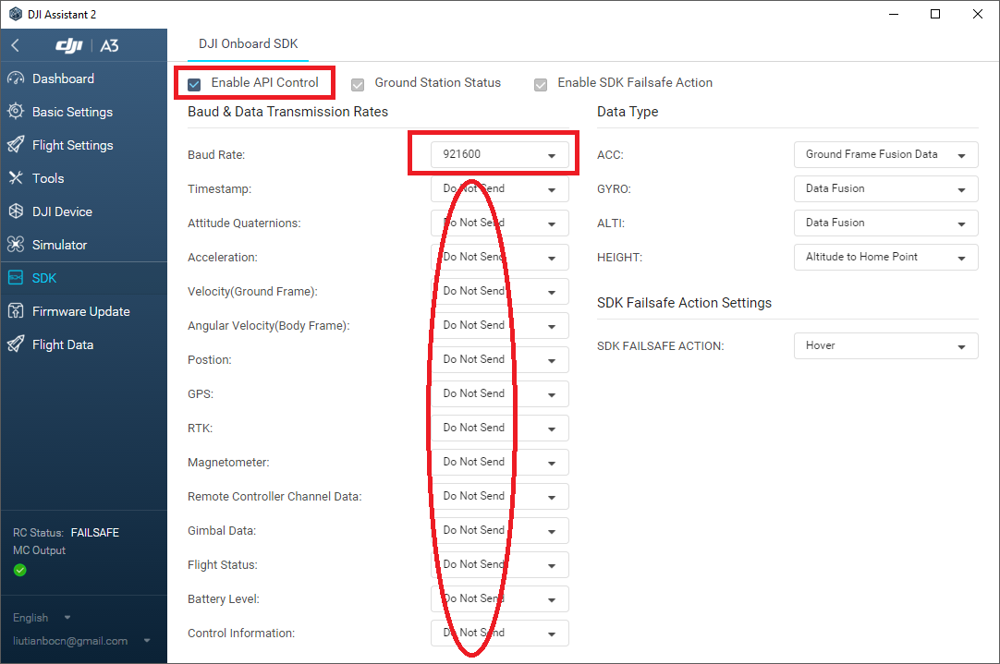
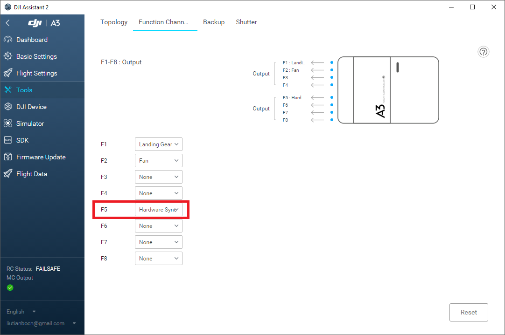
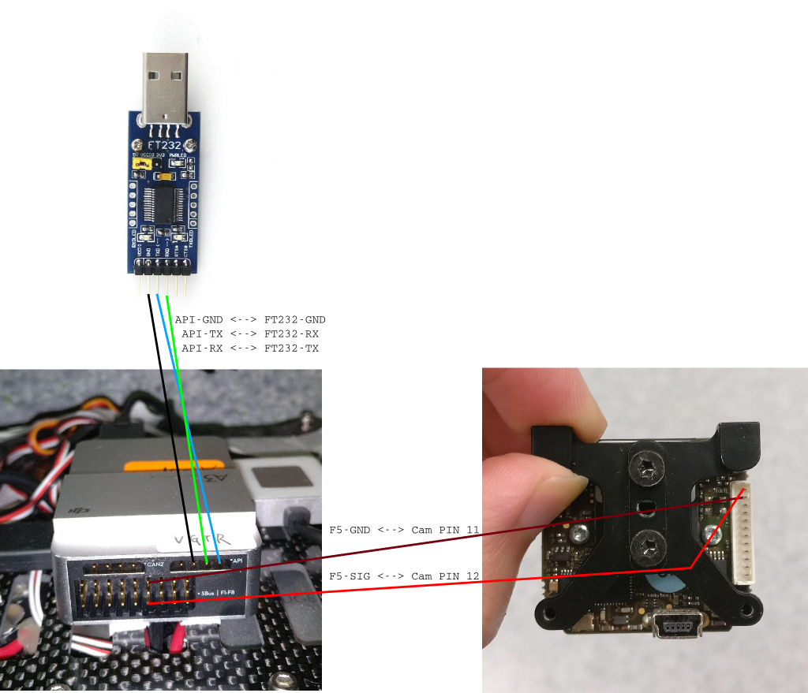

## Step by Step Tutorial to Use This Package with DJI A3 ##

If you don't need IMU-BlueFOX Camera synchronization, you can safely skip steps marked by [SYNC].

Please PR or post issues if something is not clear or make you confusing.

### Hardware Preparation ###

1. Connect A3/N3 (Flight controller and LED module), LightBridge 2 (Air system and Ground system, connected to DJI GO App with Internet access). Make sure that all the following parts are connected and work well. 


2. Power on all components, configurate A3 on [DJI Assistant 2](http://www.dji.com/a3/info#downloads) as below



3. [SYNC] Configurate hardware synchronization channel on [DJI Assistant 2](http://www.dji.com/a3/info#downloads) as below



4. Link the USB-TTL module with A3 and [SYNC] hardware sync wire



### Software Installation ###

1. Follow [DJI-Onboard-SDK Documentation](https://developer.dji.com/onboard-sdk/documentation/sample-doc/sample-setup.html#linux-oes) to install the [dji-sdk/Onboard-SDK](https://github.com/dji-sdk/Onboard-SDK) into your system. Generally, you can do it as
	```
	git clone https://github.com/dji-sdk/Onboard-SDK.git 
	cd Onboard-SDK/
	mkdir build
	cd build/
	cmake .. 
	make -j
	sudo make install
	```

2. In your catkin workspace, clone this repo: ```git clone https://github.com/groundmelon/djiros.git```.

3. If you do not need mvBlueFOX synchronization, just **set ENABLE_DJIFOX to false** in [CMakeLists.txt:22](../CMakeLists.txt#L22) to eliminate compile errors about mvBlueFOX drivers. 

4. [SYNC] If you need mvBlueFOX synchronization, please install the [mvBlueFOX Camera Driver](https://www.matrix-vision.com/USB2.0-single-board-camera-mvbluefox-mlc.html).

5. By default, the [launch files](../launch/) will load environment variables for APPID and ENCKEY. You can set them in your environment, for example, 

	```
	echo "export DJIROS_APPID=1234567" >> ~/.bashrc
	echo "export DJIROS_ENCKEY=xxxxxxxxxxxxxxxxxxxxxxxxxxxxxxxxxxx" >> ~/.bashrc
	source ~/.bashrc
	``` 

	Alternatively, you can edit [launch/djiros.launch](../launch/djiros.launch) or [launch/djifox.launch (with SYNC)](../launch/djifox.launch), and fill in your APPID and ENCKEY in the parameter fields. 

	For members of [HKUST-Aerial-Robotics-Group](https://uav.ust.hk), please see ```Dropbox/reading/code/uavteam/DJISDK_APP_KEY.txt``` for id and key. 

6. If no sync is needed, it is advised to set ```align_with_fmu``` as ```false```.

7. Remember to grant permission for operating the serial ports. There are many methods, such as [add your user into group dialout](https://askubuntu.com/questions/373096/how-do-i-permanently-change-permissions-for-dev-ttys0), or follow [this tutorial](http://hintshop.ludvig.co.nz/show/persistent-names-usb-serial-devices/) to set mode as 0666 by udev. For the latter method, [an example rule file](../docs/99-ftdi.rules) is provided.

8. [SYNC] Edit [launch/djifox.launch](../launch/djifox.launch), set your serial number of the mvBlueFOX camera in the field ```camera0/serial```. Other camera parameters can be set accordingly. Typically, ```fast_mode: false``` is for fps <= 25, and ```fast_mode: true``` is for 30 <= fps < 50.

### Launch the Package ###

1. Use roslaunch to launch the nodes: ``` roslaunch djiros djiros.launch ``` or [SYNC] ``` roslaunch djiros djifox.launch ```

2. If you see some printing of "NEW DEVICE", please make sure that your DJI GO has Internet access and try again and again for several times.
